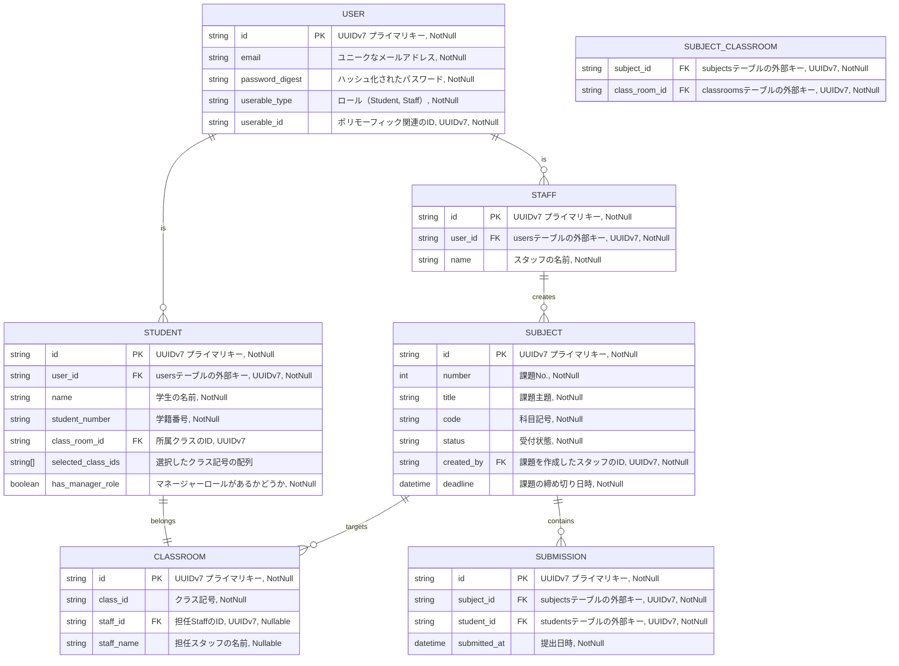

```mermaid
erDiagram
	USER ||--o{ STUDENT : "is"
	USER ||--o{ STAFF : "is"
	USER {
		string id PK "UUIDv7 プライマリキー, NotNull"
		string email "ユニークなメールアドレス, NotNull"
		string password_digest "ハッシュ化されたパスワード, NotNull"
		string userable_type "ロール（Student, Staff）, NotNull"
		string userable_id "ポリモーフィック関連のID, UUIDv7, NotNull"
	}
	STUDENT {
		string id PK "UUIDv7 プライマリキー, NotNull"
		string user_id FK "usersテーブルの外部キー, UUIDv7, NotNull"
		string name "学生の名前, NotNull"
		string student_number "学籍番号, NotNull"
		string class_room_id FK "所属クラスのID, UUIDv7"
		string[] selected_class_ids "選択したクラス記号の配列"
		boolean has_manager_role "マネージャーロールがあるかどうか, NotNull"
	}
	CLASSROOM {
		string id PK "UUIDv7 プライマリキー, NotNull"
		string class_id "クラス記号, NotNull"
		string staff_id FK "担任StaffのID, UUIDv7, Nullable"
		string staff_name "担任スタッフの名前, Nullable"
	}
	STUDENT ||--|| CLASSROOM : "belongs"
	STAFF {
		string id PK "UUIDv7 プライマリキー, NotNull"
		string user_id FK "usersテーブルの外部キー, UUIDv7, NotNull"
		string name "スタッフの名前, NotNull"
	}
	SUBJECT ||--o{ SUBMISSION : contains
	STAFF ||--o{ SUBJECT : creates
	SUBJECT ||--o{ CLASSROOM : "targets"
	SUBJECT {
		string id PK "UUIDv7 プライマリキー, NotNull"
		int number "課題No., NotNull"
		string title "課題主題, NotNull"
		string code "科目記号, NotNull"
		string status "受付状態, NotNull"
		string created_by FK "課題を作成したスタッフのID, UUIDv7, NotNull"
		datetime deadline "課題の締め切り日時, NotNull"
	}
	SUBMISSION {
		string id PK "UUIDv7 プライマリキー, NotNull"
		string subject_id FK "subjectsテーブルの外部キー, UUIDv7, NotNull"
		string student_id FK "studentsテーブルの外部キー, UUIDv7, NotNull"
		datetime submitted_at "提出日時, NotNull"
	}
	SUBJECT_CLASSROOM {
		string subject_id FK "subjectsテーブルの外部キー, UUIDv7, NotNull"
		string class_room_id FK "classroomsテーブルの外部キー, UUIDv7, NotNull"
	}


```
