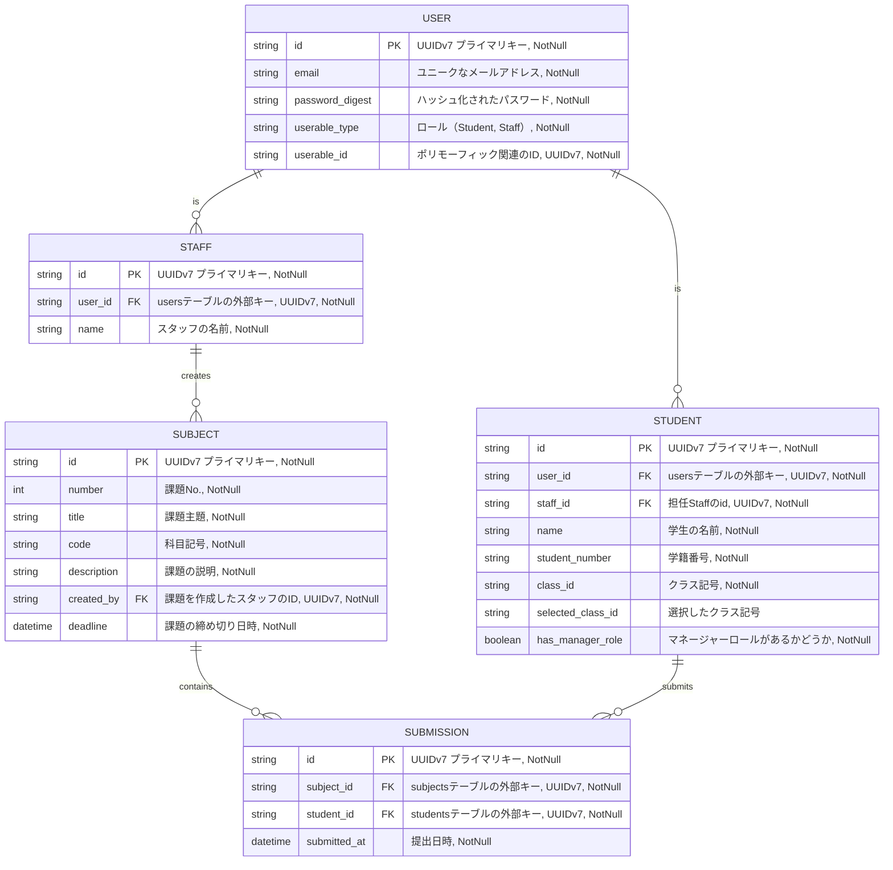

```mermaid
erDiagram
    USER ||--o{ STUDENT : "is"
    USER ||--o{ STAFF : "is"
    USER {
        string id PK "UUIDv7 プライマリキー, NotNull"
        string email "ユニークなメールアドレス, NotNull"
        string password_digest "ハッシュ化されたパスワード, NotNull"
        string userable_type "ロール（Student, Staff）, NotNull"
        string userable_id "ポリモーフィック関連のID, UUIDv7, NotNull"
    }
    STUDENT {
        string id PK "UUIDv7 プライマリキー, NotNull"
        string user_id FK "usersテーブルの外部キー, UUIDv7, NotNull"
        string staff_id FK "担任Staffのid, UUIDv7, NotNull"
        string name "学生の名前, NotNull"
        string student_number "学籍番号, NotNull"
        string class_id "クラス記号, NotNull"
        string selected_class_id "選択したクラス記号"
        boolean has_manager_role "マネージャーロールがあるかどうか, NotNull"
    }
    STAFF {
        string id PK "UUIDv7 プライマリキー, NotNull"
        string user_id FK "usersテーブルの外部キー, UUIDv7, NotNull"
        string name "スタッフの名前, NotNull"
    }
    SUBJECT ||--o{ SUBMISSION : contains
    STAFF ||--o{ SUBJECT : creates
    STUDENT ||--o{ SUBMISSION : submits
    SUBJECT {
        string id PK "UUIDv7 プライマリキー, NotNull"
        int number "課題No., NotNull"
        string title "課題主題, NotNull"
        string code "科目記号, NotNull"
        string description "課題の説明, NotNull"
        string created_by FK "課題を作成したスタッフのID, UUIDv7, NotNull"
        datetime deadline "課題の締め切り日時, NotNull"
    }
    SUBMISSION {
        string id PK "UUIDv7 プライマリキー, NotNull"
        string subject_id FK "subjectsテーブルの外部キー, UUIDv7, NotNull"
        string student_id FK "studentsテーブルの外部キー, UUIDv7, NotNull"
        datetime submitted_at "提出日時, NotNull"
    }

```
