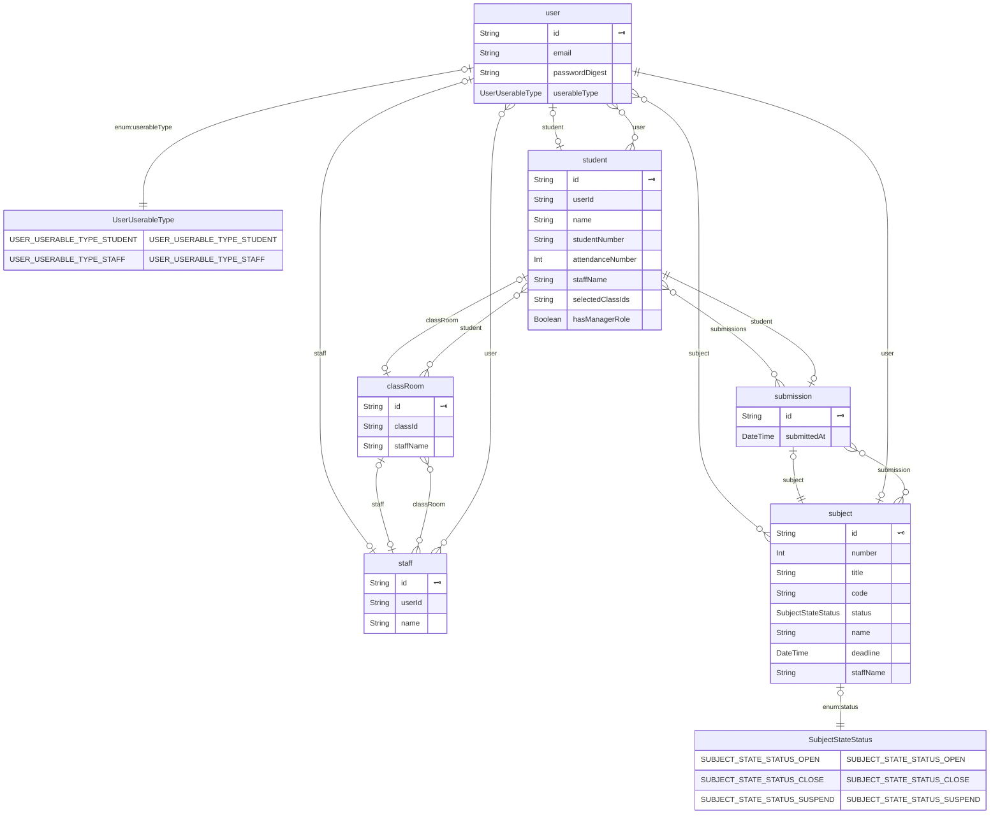

```mermaid
erDiagram

        UserUserableType {
            USER_USERABLE_TYPE_STUDENT USER_USERABLE_TYPE_STUDENT
USER_USERABLE_TYPE_STAFF USER_USERABLE_TYPE_STAFF
        }
    


        SubjectStateStatus {
            SUBJECT_STATE_STATUS_OPEN SUBJECT_STATE_STATUS_OPEN
SUBJECT_STATE_STATUS_CLOSE SUBJECT_STATE_STATUS_CLOSE
SUBJECT_STATE_STATUS_SUSPEND SUBJECT_STATE_STATUS_SUSPEND
        }
    
  "user" {
    String id "🗝️"
    String email 
    String passwordDigest 
    UserUserableType userableType 
    }
  

  "student" {
    String id "🗝️"
    String userId 
    String name 
    String studentNumber 
    Int attendanceNumber 
    String staffName 
    String selectedClassIds 
    Boolean hasManagerRole 
    }
  

  "staff" {
    String id "🗝️"
    String userId 
    String name 
    }
  

  "classRoom" {
    String id "🗝️"
    String classId 
    String staffName 
    }
  

  "subject" {
    String id "🗝️"
    Int number 
    String title 
    String code 
    SubjectStateStatus status 
    String name 
    DateTime deadline 
    String staffName 
    }
  

  "submission" {
    String id "🗝️"
    DateTime submittedAt 
    }
  
    "user" o|--|| "UserUserableType" : "enum:userableType"
    "user" o|--|o "student" : "student"
    "user" o|--|o "staff" : "staff"
    "user" o{--}o "subject" : "subject"
    "student" o|--|o "classRoom" : "classRoom"
    "student" o{--}o "submission" : "submissions"
    "student" o{--}o "user" : "user"
    "staff" o{--}o "classRoom" : "classRoom"
    "staff" o{--}o "user" : "user"
    "classRoom" o|--|o "staff" : "staff"
    "classRoom" o{--}o "student" : "student"
    "subject" o|--|| "SubjectStateStatus" : "enum:status"
    "subject" o|--|| "user" : "user"
    "subject" o{--}o "submission" : "submission"
    "submission" o|--|| "student" : "student"
    "submission" o|--|| "subject" : "subject"
```
