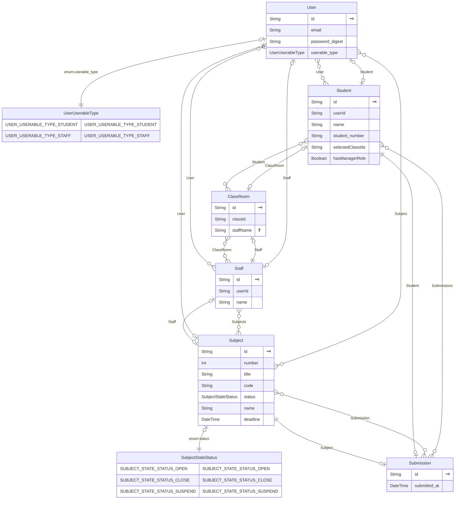

```mermaid
erDiagram

        UserUserableType {
            USER_USERABLE_TYPE_STUDENT USER_USERABLE_TYPE_STUDENT
USER_USERABLE_TYPE_STAFF USER_USERABLE_TYPE_STAFF
        }
    


        SubjectStateStatus {
            SUBJECT_STATE_STATUS_OPEN SUBJECT_STATE_STATUS_OPEN
SUBJECT_STATE_STATUS_CLOSE SUBJECT_STATE_STATUS_CLOSE
SUBJECT_STATE_STATUS_SUSPEND SUBJECT_STATE_STATUS_SUSPEND
        }
    
  "User" {
    String id "🗝️"
    String email 
    String password_digest 
    UserUserableType userable_type 
    }
  

  "Student" {
    String id "🗝️"
    String userId 
    String name 
    String student_number 
    String selectedClassIds 
    Boolean hasManagerRole 
    }
  

  "Staff" {
    String id "🗝️"
    String userId 
    String name 
    }
  

  "ClassRoom" {
    String id "🗝️"
    String classId 
    String staffName "❓"
    }
  

  "Subject" {
    String id "🗝️"
    Int number 
    String title 
    String code 
    SubjectStateStatus status 
    String name 
    DateTime deadline 
    }
  

  "Submission" {
    String id "🗝️"
    DateTime submitted_at 
    }
  
    "User" o|--|| "UserUserableType" : "enum:userable_type"
    "User" o|--|o "Student" : "Student"
    "User" o|--|o "Staff" : "Staff"
    "User" o{--}o "Subject" : "Subject"
    "Student" o|--|o "ClassRoom" : "ClassRoom"
    "Student" o{--}o "Submission" : "Submissions"
    "Student" o{--}o "User" : "User"
    "Staff" o{--}o "Subject" : "Subjects"
    "Staff" o{--}o "ClassRoom" : "ClassRoom"
    "Staff" o{--}o "User" : "User"
    "ClassRoom" o|--|| "Staff" : "Staff"
    "ClassRoom" o{--}o "Student" : "Student"
    "Subject" o|--|| "SubjectStateStatus" : "enum:status"
    "Subject" o|--|| "User" : "User"
    "Subject" o{--}o "Submission" : "Submission"
    "Subject" o|--|o "Staff" : "Staff"
    "Submission" o|--|| "Student" : "Student"
    "Submission" o|--|| "Subject" : "Subject"
```
